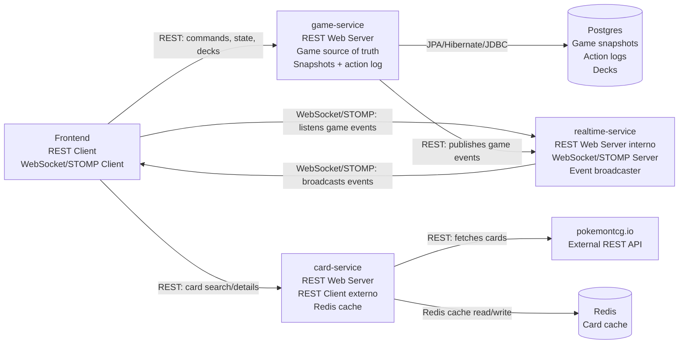
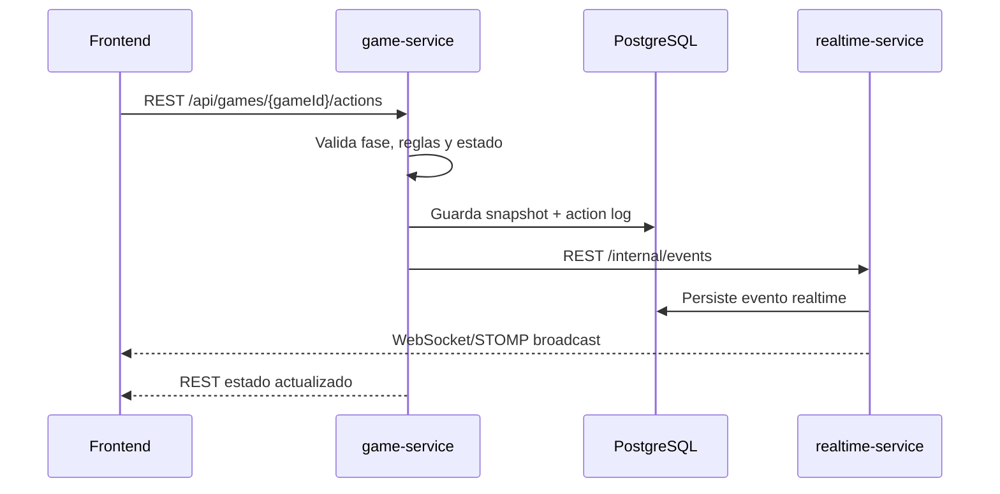

# Pokemon TCG Platform

Backend multi-servicio para una version digital de Pokemon TCG orientada a partidas de 2 jugadores, construccion de mazos XY1, persistencia de partidas y eventos en tiempo real.

El proyecto esta organizado como un parent Maven con 3 servicios Spring Boot activos:

- `game-service`: reglas del juego, partidas, mazos, persistencia y publicacion de eventos.
- `card-service`: busqueda y normalizacion de cartas desde `pokemontcg.io`, con cache Redis.
- `realtime-service`: recepcion de eventos validados, persistencia de eventos y broadcast WebSocket/STOMP.

La carpeta `src/` de la raiz corresponde a una etapa monolitica anterior. La implementacion activa esta en `game-service/`, `card-service/` y `realtime-service/`.

## Consigna Del TPI

La consigna pide una aplicacion de Pokemon TCG jugable de punta a punta para 2 jugadores, con backend como fuente de verdad. El alcance tecnico trabajado incluye:

- reglas principales de partida: setup, mulligan, activo, banca, premios, turnos, ataques, KO y victoria;
- tipos de cartas relevantes: Pokemon, Pokemon Basico, Pokemon EX, Energia, Entrenador, Supporter e Item;
- construccion y validacion de mazos para set `xy1`;
- persistencia de estado y log de acciones;
- comunicacion en tiempo real por WebSocket;
- reconexion mediante estado actual y eventos pendientes;
- frontend como consumidor REST + WebSocket, sin reglas de juego propias.

## Estado Actual

Implementado:

- Backend dividido en 3 servicios Spring Boot.
- CRUD de mazos y validacion basica XY1.
- Creacion, union y setup de partidas con `deckId`.
- Zonas de juego: mazo, mano, premios, descarte, activo y banca.
- Turnos con fases `DRAW`, `MAIN`, `ATTACK`, `BETWEEN_TURNS`.
- Acciones: robar, unir energia, jugar supporter, retreat, atacar, aplicar condicion, resolver entre turnos y terminar turno.
- Ataque con pipeline, energia requerida, dano, debilidad/resistencia modelada, KO, premios y victoria.
- Condiciones especiales modeladas: `ASLEEP`, `PARALYZED`, `CONFUSED`, `POISONED`, `BURNED`.
- Snapshots y action log en PostgreSQL.
- Eventos realtime persistidos y emitidos por WebSocket/STOMP.
- Swagger UI en los 3 servicios.
- Tests unitarios e integracion de backend.

Pendiente o parcial:

- Frontend completo: lobby, deck builder, tablero, drag and drop, log visual.
- Integracion automatica entre deck builder y `card-service` para no cargar datos de cartas manualmente.
- Reglas avanzadas de cartas Trainer/Item/Supporter y efectos especificos de cada carta.
- Autenticacion real/JWT para reemplazar validacion simple por `playerId`.
- E2E con frontend real.

## Arquitectura General



## Flujo De Una Accion



## Tecnologias

- Java 21
- Maven multi-modulo
- Spring Boot 3.5.14
- Spring Web
- Spring WebSocket/STOMP
- Spring Data JPA
- Hibernate
- Flyway
- PostgreSQL 16
- Redis 7
- Spring Validation
- Springdoc OpenAPI / Swagger UI
- JUnit 5 + Spring Boot Test + Mockito
- Docker Compose

## Servicios Y Puertos

| Servicio | Puerto | Responsabilidad |
| --- | ---: | --- |
| `game-service` | 8081 | Partidas, reglas, mazos, snapshots, action log |
| `realtime-service` | 8082 | Eventos realtime, WebSocket/STOMP, reconexion |
| `card-service` | 8083 | Cartas desde `pokemontcg.io`, normalizacion y cache |
| PostgreSQL | 5433 | Base local compartida |
| Redis | 6380 | Cache local expuesta al host |

Dentro de Docker, Redis escucha en `redis:6379` y PostgreSQL en `postgres:5432`.

## Requisitos Para Levantar Por Primera Vez

Instalar:

- JDK 21
- Maven 3.9+
- Docker Desktop
- Git

Verificar:

```bash
java -version
mvn -version
docker --version
```

La API key de `pokemontcg.io` es opcional. Sin key, `card-service` puede consultar igual, pero con limites publicos.

## Primer Levantado Local Recomendado

Desde la raiz del proyecto:

```bash
cd /Users/franciscorodriguezpons/Documents/pokemon-new/POKEMON-TCG
```

1. Compilar y bajar dependencias Maven:

```bash
mvn clean package
```

2. Levantar infraestructura:

```bash
docker compose up -d postgres redis
```

3. Levantar `realtime-service`:

```bash
mvn -pl realtime-service spring-boot:run
```

4. Levantar `game-service` en otra terminal:

```bash
mvn -pl game-service spring-boot:run
```

5. Levantar `card-service` en otra terminal:

```bash
REDIS_PORT=6380 mvn -pl card-service spring-boot:run
```

Usamos `REDIS_PORT=6380` porque Docker expone Redis al host en el puerto `6380`.

## Variables De Entorno Utiles

`game-service`:

```bash
PORT=8081
DB_URL=jdbc:postgresql://localhost:5433/pokemontcg
DB_USER=postgres
DB_PASSWORD=postgres
REALTIME_URL=http://localhost:8082
```

`realtime-service`:

```bash
PORT=8082
DB_URL=jdbc:postgresql://localhost:5433/pokemontcg
DB_USER=postgres
DB_PASSWORD=postgres
```

`card-service`:

```bash
PORT=8083
REDIS_HOST=localhost
REDIS_PORT=6380
POKEMON_TCG_API_KEY=
```

## Swagger

Con los servicios levantados:

- Game Service: http://localhost:8081/swagger-ui/index.html
- Realtime Service: http://localhost:8082/swagger-ui/index.html
- Card Service: http://localhost:8083/swagger-ui/index.html

## Endpoints Principales

`game-service`:

- `POST /api/decks`
- `PUT /api/decks/{deckId}`
- `GET /api/decks/{deckId}`
- `GET /api/decks?playerId={playerId}`
- `DELETE /api/decks/{deckId}`
- `POST /api/games`
- `POST /api/games/{gameId}/join`
- `POST /api/games/{gameId}/setup`
- `POST /api/games/{gameId}/actions`
- `GET /api/games/{gameId}`
- `GET /api/games/{gameId}/actions`
- `GET /api/games/{gameId}/sync`

`card-service`:

- `GET /api/cards?q=set.id:xy1&pageSize=20`
- `GET /api/cards/{id}`

`realtime-service`:

- `POST /internal/events`
- `GET /internal/events/{gameId}?sinceSequence={lastSeenSequence}`
- WebSocket/STOMP: `/ws`
- Topic de partida: `/topic/games/{gameId}/events`

## Acciones De Juego Soportadas

En `POST /api/games/{gameId}/actions`:

- `DRAW`
- `ATTACH_ENERGY`
- `PLAY_SUPPORTER`
- `RETREAT`
- `ATTACK`
- `END_TURN`
- `TAKE_PRIZE`
- `APPLY_SPECIAL_CONDITION`
- `RESOLVE_BETWEEN_TURNS`

Para condicion especial se puede enviar `condition` con:

- `ASLEEP`
- `PARALYZED`
- `CONFUSED`
- `POISONED`
- `BURNED`

## Eventos Realtime

Eventos actuales emitidos por `realtime-service`:

- `GAME_CREATED`
- `PLAYER_JOINED`
- `GAME_SETUP`
- `SETUP_COMPLETED`
- `TURN_STARTED`
- `TURN_PHASE_CHANGED`
- `CARD_DRAWN`
- `ENERGY_ATTACHED`
- `SUPPORTER_PLAYED`
- `RETREAT_DECLARED`
- `ATTACK_RESOLVED`
- `KO`
- `PRIZE_TAKEN`
- `STATUS_APPLIED`
- `BETWEEN_TURNS_RESOLVED`
- `GAME_FINISHED`
- `STATE_SYNCED`

El cliente WebSocket debe suscribirse al topic de la partida enviando el header STOMP `playerId`. Hoy esa validacion es simple y sirve para el TPI; para produccion deberia reemplazarse por autenticacion real.

## Persistencia Y Migraciones

`game-service` usa PostgreSQL para:

- mazos;
- cartas cacheadas localmente para mazos;
- snapshots completos de partida;
- action log inmutable.

`realtime-service` usa PostgreSQL para:

- eventos realtime;
- reconexion por `sinceSequence`.

Flyway aplica migraciones al iniciar:

- `game-service/src/main/resources/db/migration`
- `realtime-service/src/main/resources/db/migration/realtime`

`realtime-service` usa una tabla de historial propia: `realtime_flyway_schema_history`, para no chocar con las migraciones del `game-service`.

## Tests

Correr todos los tests:

```bash
mvn test
```

Correr un servicio especifico:

```bash
mvn -pl game-service test
mvn -pl card-service test
mvn -pl realtime-service test
```

Cobertura actual del flujo backend:

- motor de reglas;
- validacion de turnos;
- setup con mazos reales;
- KO, premios y victoria;
- serializacion de snapshots;
- deck builder;
- card service;
- realtime REST + WebSocket;
- flujo `game-service` observer -> `realtime-service` -> WebSocket.

## Documentacion Complementaria

- `docs/game-service-manual-test.md`: guia manual con `curl`.
- `docs/microservices-architecture.md`: diagramas de comunicacion.
- `docs/realtime-contract.md`: contrato de eventos realtime.
- `docs/phase-0/mvp-scope.md`: alcance MVP segun consigna.
- `docs/phase-0/definition-of-done-rf.md`: DoD por requerimiento funcional.
- `docs/phase-0/product-backlog-stories.md`: backlog tecnico.

## Notas Importantes

- El backend es la fuente de verdad: el frontend no deberia decidir reglas de juego.
- `game-service` valida acciones y guarda estado antes de publicar eventos.
- `realtime-service` no modifica partidas; solo persiste y distribuye eventos.
- `card-service` no participa durante una partida ya iniciada; se usa para busqueda/normalizacion de cartas antes de guardar mazos.
- Para correr servicios con Maven, mantener levantados PostgreSQL y Redis con Docker.
