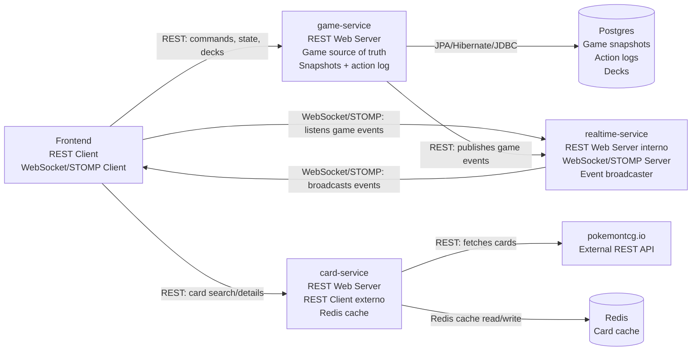
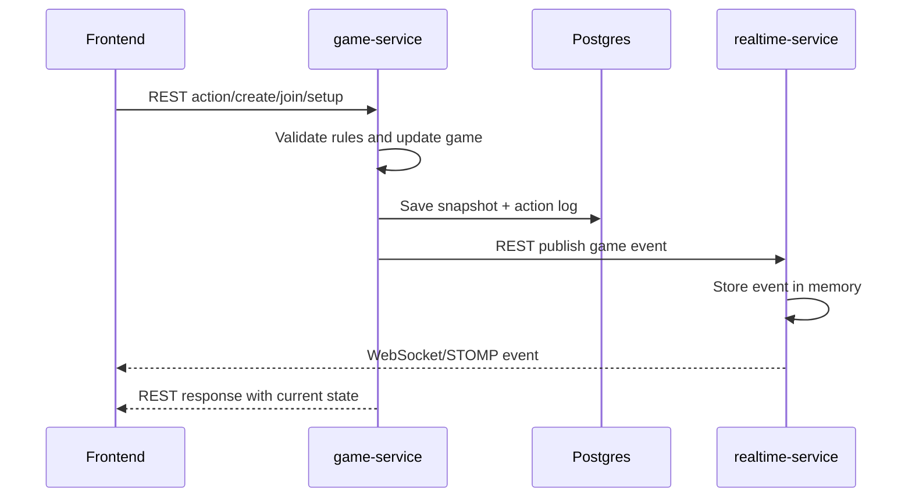

# Arquitectura de comunicacion entre servicios

## Vista general

## Flujo de una accion de juego

## Resumen

- `game-service` es la fuente de verdad del juego.
- `realtime-service` distribuye eventos, pero no modifica partidas.
- `card-service` consulta cartas externas y cachea resultados.
- El frontend deberia usar REST para comandos/estado y WebSocket/STOMP para eventos en tiempo real.
